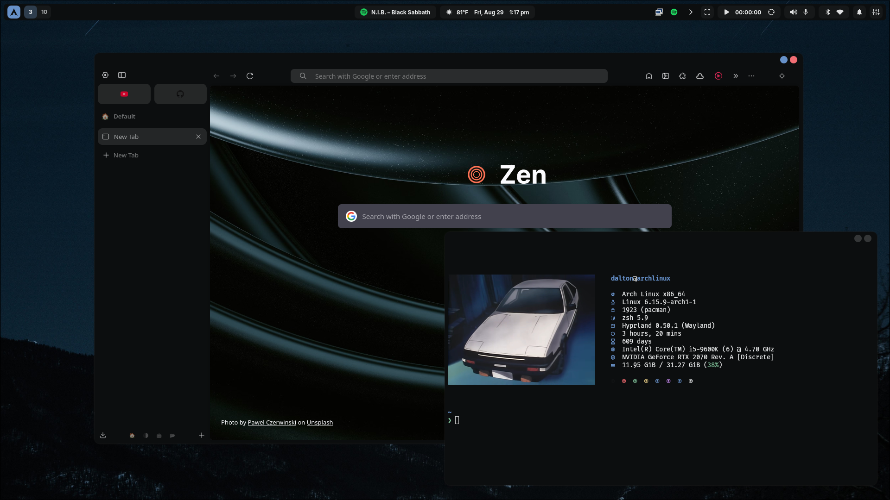
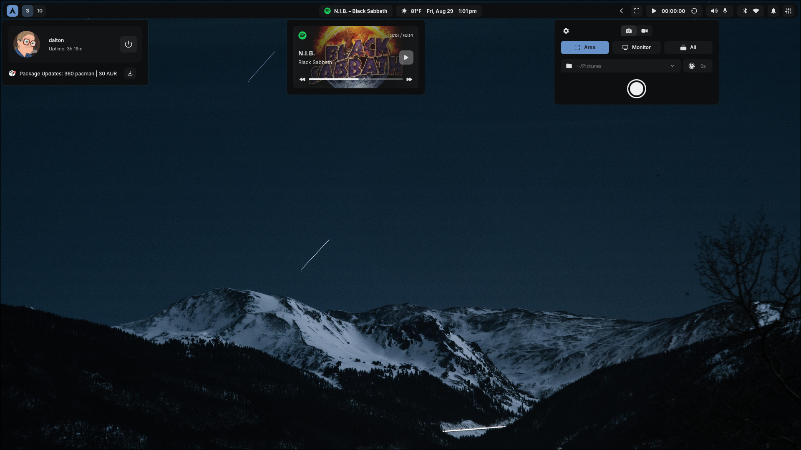
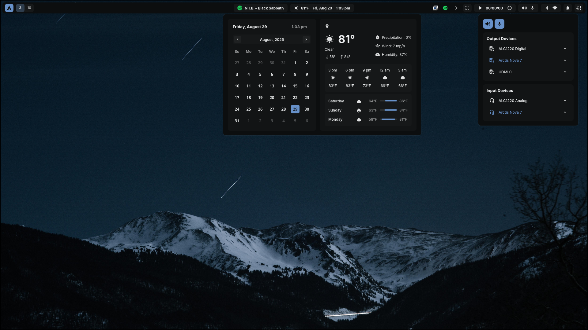
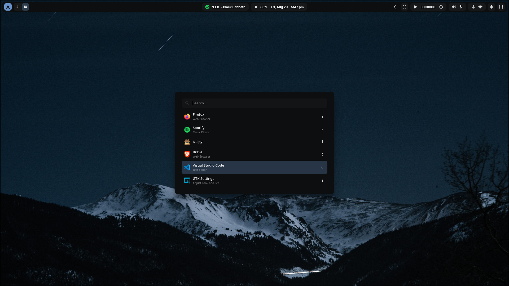
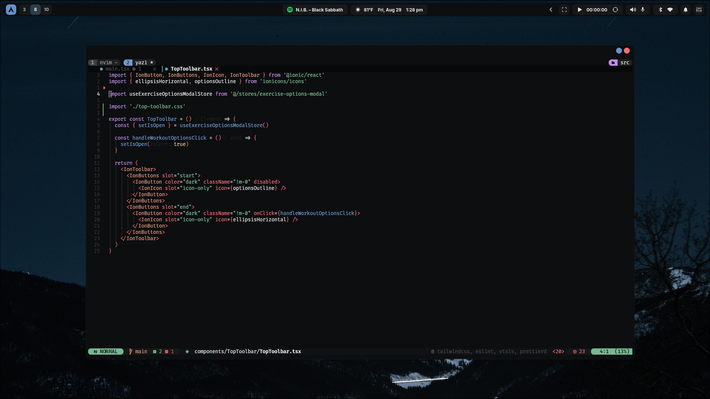
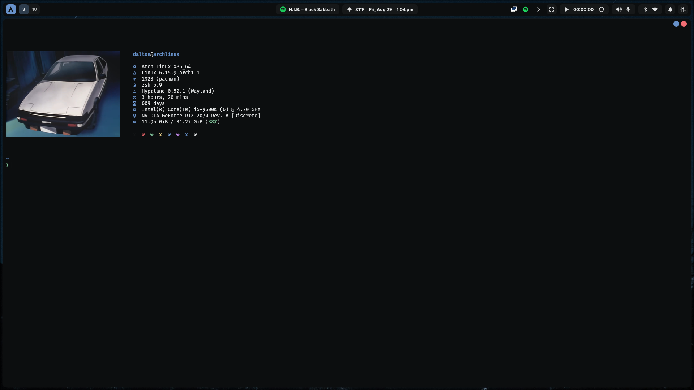
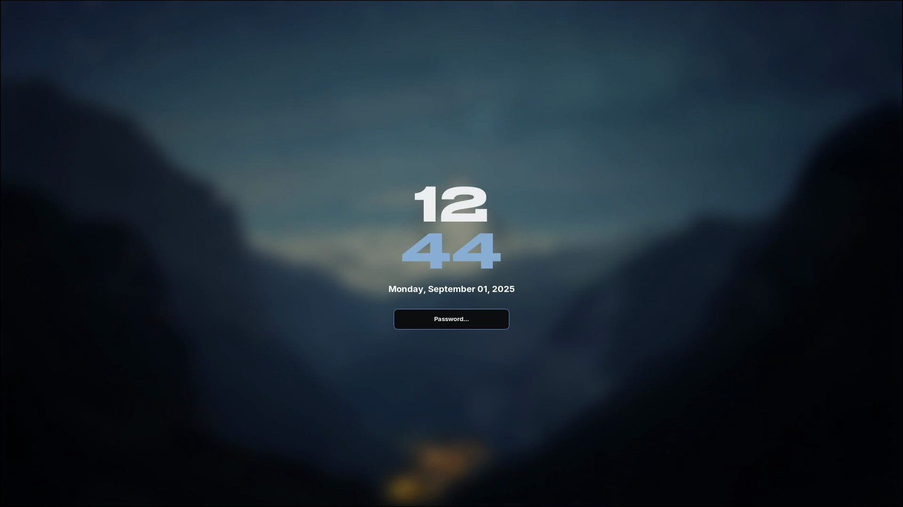

# Dotfiles


<a href="#screenshots">More Screenshots</a>
<br></br>

Welcome to my Arch Linux dotfiles, here's what I'm using:

- Window Manager: <a href="https://hypr.land/" target="_blank" rel="noopener noreferrer">Hyprland</a>
- Shell: <a href="https://quickshell.org/" target="_blank" rel="noopener noreferrer">Quickshell</a>
- Terminal: <a href="https://sw.kovidgoyal.net/kitty/" target="_blank" rel="noopener noreferrer">kitty</a>
- Shell: <a href="https://zsh.sourceforge.io/" target="_blank" rel="noopener noreferrer">ZSH</a>
- Prompt: <a href="https://starship.rs/" target="_blank" rel="noopener noreferrer">Starship</a>
- Editor: <a href="https://neovim.io/" target="_blank" rel="noopener noreferrer">Neovim</a>
- Launcher: <a href="https://github.com/abenz1267/walker" target="_blank" rel="noopener noreferrer">Walker</a>
- Additional tools: paru, tmux, yazi, zoxide, lazygit, swww, fastfetch, and many more
  - See [`/tasks/packages.yml`](./tasks/packages.yml) for the full list of packages

### Installing

I use `ansible` to automate the installation process, after cloning the repo, you'll need to <a href="https://wiki.archlinux.org/title/Ansible" target="_blank" rel="noopener noreferrer">install it</a> and run the following commands:

1. Install `ansible` (Arch)

```sh
sudo pacman -S ansible
```

2. Install ansible requirements, which just installs the <a href="https://github.com/kewlfft/ansible-aur" target="_blank" rel="noopener noreferrer">kewlfft.aur</a> module to manage packages from the AUR

```sh
ansible-galaxy collection install -r requirements.yml
```

3. Do a dry run of the playbook to ensure everything works

```sh
ansible-playbook main.yml --ask-become-pass -DC
```

4. Finally, run the playbook

```sh
ansible-playbook main.yml --ask-become-pass
```

### Screenshots

|                                           Bar & Widgets                                            |
| :------------------------------------------------------------------------------------------------: |
|                           |
|   |
|  |

|                                 Launcher                                  |
| :-----------------------------------------------------------------------: |
|  |

|                               Neovim                                |
| :-----------------------------------------------------------------: |
|  |

|                                  Kitty                                   |
| :----------------------------------------------------------------------: |
|  |

|                                   Lock Screen                                   |
| :-----------------------------------------------------------------------------: |
|  |
